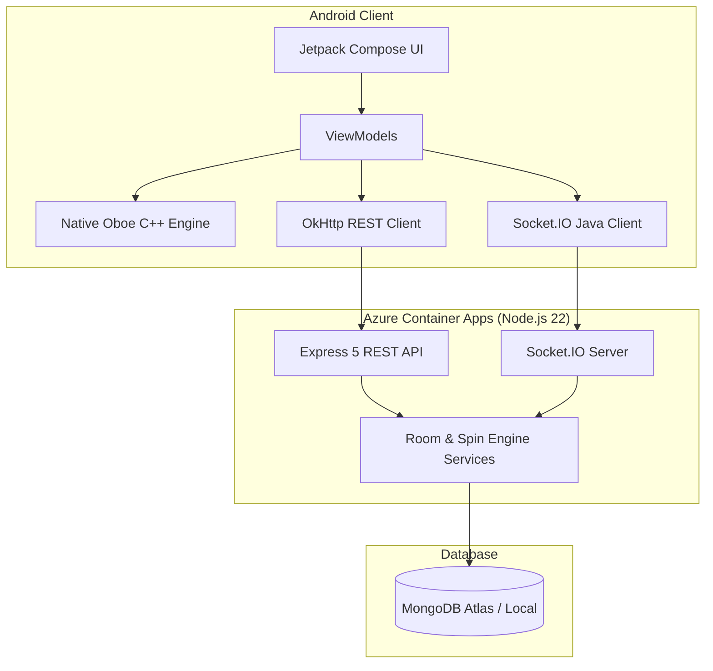

# RoxStar — Voice Draft, Real-Time Room & Spin Wheel System

**RoxStar** is an end-to-end multi-tier system built for the candidate technical assessment. It features a native Android voice studio powered by Google Oboe C++, a Node.js 22 real-time room service over Express 5 and Socket.IO, and a server-authoritative multiplayer spin wheel game backed by MongoDB and deployed on Azure Container Apps.

The system delivers three core capabilities:
- **Android Voice Studio**: High-quality microphone recording, real-time DSP audio effects (Echo, Reverb, Pitch Shift) implemented in native C++, lock-free ring buffer file writing, and local draft management.
- **Real-Time Room Management**: Authoritative room creation, idempotent join/leave, presence separation, and instant draft metadata sharing across connected participants.
- **Multiplayer Spin Wheel**: Server-authoritative elimination wheel operating on a 5-second cadence, protected against race conditions via MongoDB partial unique indexes and atomic Compare-And-Swap (CAS) state updates.

---

## Features

- **Native Audio Capture & Processing**: Oboe input/output streams with C++17 lock-free `RingBuffer`, zero audio callback allocations, and real-time DSP effects (Echo, Reverb, Pitch Shift).
- **Local Draft Studio**: Persistent local WAV recording storage (`filesDir/drafts/`), JSON metadata tracking, native Oboe playback, and clean deletion workflows.
- **Authoritative REST API**: Room creation, idempotent joining/leaving, state retrieval, and draft sharing endpoints backed by Zod input validation and correlation tracking (`x-request-id`).
- **Real-Time Event Engine**: Socket.IO synchronization delivering 7 mandatory room events with automatic presence tracking and reconnection state recovery.
- **Server-Authoritative Spin Engine**: 5-second elimination scheduler, 3–20 player validation, CAS winner determination, and multi-event log persistence.
- **Cloud Infrastructure**: Multi-stage Dockerized deployment running single-replica on Azure Container Apps with OIDC CI/CD automation and MongoDB Atlas integration.

---

## User Flow

```
+------------------+     +-------------------+     +------------------+     +------------------+
| Record Microphone| --> | Apply DSP Effect  | --> | Save Local Draft | --> | Create/Join Room |
| (Oboe C++ Stream)|     | Echo/Reverb/Pitch |     | (WAV + JSON)     |     | (Express REST)   |
+------------------+     +-------------------+     +------------------+     +------------------+
                                                                                     |
+------------------+     +-------------------+     +------------------+              |
| Winner Announced | <-- | Timed Eliminations| <-- | Start Spin Wheel | <-- Share Draft /|
| (CAS DB Update)  |     | (5s Event Ticks)  |     | (Owner Action)   |     Realtime Sync|
+------------------+     +-------------------+     +------------------+     +------------------+
```

1. **Audio Recording**: The user records audio through Oboe input streams, applying a DSP effect (Echo, Reverb, Pitch Shift) before saving to local storage (`filesDir/drafts/<id>.wav`).
2. **Room Participation**: The user creates or joins a room (`POST /rooms/:roomId/join`) and connects to the Socket.IO channel to receive presence updates.
3. **Draft Sharing**: The user shares a saved draft metadata to the room (`POST /rooms/:roomId/drafts`), broadcasting a `draft_shared` event to all participants.
4. **Spin Wheel Execution**: The room owner starts a spin wheel (`POST /rooms/:roomId/spins`). The server snapshot-locks eligible players, broadcasts `spin_started`, and eliminates one participant every 5 seconds until exactly one winner remains (`winner_announced`).

---

## Architecture Overview



Detailed technical documentation is available in the [`docs/`](docs/) directory:
- [System Architecture](docs/architecture/system-architecture.md)
- [Audio Flow & DSP Engine](docs/audio/audio-flow.md)
- [Real-Time WebSockets & Event Specifications](docs/websocket/event-flow.md)
- [Spin State Machine Specification](docs/spin/state-machine.md)
- [Spin Sequence & Timing Specification](docs/spin/sequence.md)
- [Database Design & Schema Invariants](docs/database/database-design.md)
- [Testing & Verification Report](docs/testing/verification.md)
- [Azure Deployment Runbook](docs/deployment/azure-deployment.md)
- [Trade-offs, Assumptions & Limitations](docs/architecture/tradeoffs-and-assumptions.md)

---

## Repository Structure

```
.
├── android-app/          # Android Compose UI, ViewModels, JNI bindings, OkHttp & Socket.IO clients
├── native-audio/         # Native C++ Oboe engine, DSP effects (Echo/Reverb/Pitch), WavWriter, WavReader
│   └── tests/            # C++17 unit test suite for native audio components
├── backend/              # Node.js 22 + TypeScript Express 5 service & Socket.IO server
│   ├── src/              # Controllers, services, repositories, schemas, and websocket handlers
│   ├── tests/            # Vitest unit (tests/unit) and integration (tests/integration) suites
│   └── scripts/          # Cloud smoke test suite (smoke.mjs)
├── database/             # Schema references and data model documentation
├── infrastructure/       # Azure Container Apps manifests, Dockerfile, and docker-compose.yml
├── docs/                 # Architectural specifications, sequence diagrams, and deployment runbooks
├── TASKS.md              # Requirement traceability matrix and verification log
├── ARCHITECTURE.md       # Primary architecture specification
└── README.md             # Project documentation entry point
```

---

## Tech Stack

- **Android App**: Kotlin, Jetpack Compose, Coroutines, StateFlow, ViewModel.
- **Native Audio**: C++17, Google Oboe (AAudio/OpenSL ES), JNI, CMake, CMake/NDK r26b.
- **Backend**: Node.js 22, TypeScript, Express 5, Socket.IO 4, Mongoose 8, Zod, Pino.
- **Database**: MongoDB 7 / MongoDB Atlas.
- **Containerization & CI/CD**: Docker (Pinned `node:22-alpine`), GitHub Actions (OIDC Federation), Azure Container Registry (ACR), Azure Container Apps (ACA).

---

## Prerequisites

- **Node.js**: v22.0.0 or higher (`node -v`)
- **Docker**: Docker Desktop with Docker Compose
- **Java Development Kit**: JDK 17 or JDK 21 (`java -version`)
- **Android Studio**: Ladybug / 2024.2+ with Android SDK 34 and NDK r26b

---

## Local Setup

### 1. Clone & Infrastructure Setup
```bash
git clone https://github.com/sameerakmal/Roxstar.git
cd Roxstar

# Start local MongoDB container
docker compose -f infrastructure/docker-compose.yml up -d mongo
```

### 2. Backend Setup & Run
```bash
cd backend
cp .env.example .env
npm install

# Run backend in development watch mode
npm run dev
```
The backend server starts on `http://localhost:3000`.

### 3. Android Client Setup
1. Open `android-app/` in Android Studio.
2. Ensure NDK r26b is installed via SDK Manager.
3. Build the project (`Build -> Make Project` or `./gradlew assembleDebug`).
4. To connect an emulator to the local backend, update `BASE_URL` in `RoomApiClient.kt` to `http://10.0.2.2:3000`.

---

## Environment Variables

Copy `backend/.env.example` to `backend/.env`. Key runtime configuration variables:

| Variable | Required | Default | Purpose |
|---|---|---|---|
| `NODE_ENV` | no | `development` | Environment mode (`development` \| `test` \| `production`). |
| `PORT` | no | `3000` | HTTP and WebSocket server listening port. |
| `MONGODB_URI` | **yes** | `mongodb://localhost:27017/roxstar` | MongoDB connection URI. |
| `LOG_LEVEL` | no | `info` | Logging verbosity (`fatal` \| `error` \| `warn` \| `info` \| `debug`). |
| `SPIN_ELIMINATION_INTERVAL_MS` | no | `5000` | Elimination tick duration in milliseconds. |

> **Security Note**: No real passwords or secrets are committed to git. `.env` is listed in `.gitignore`.

---

## Running Tests

All subsystems carry automated test coverage. Execute commands from their respective directories:

```bash
# 1. Backend Typecheck & Lint
cd backend
npm run typecheck
npm run lint

# 2. Backend Unit Tests (60 tests passed)
npm test

# 3. Backend Integration Tests (155 tests passed - requires MongoDB)
npm run test:integration

# 4. Android JVM Unit Tests (101 tests passed)
cd ../android-app
.\gradlew.bat testDebugUnitTest

# 5. Android Lint & Build Checks
.\gradlew.bat lintDebug
.\gradlew.bat assembleDebug
```

### Verified Test Summary

| Test Suite | Target | Executable Command | Test Count | Status |
|---|---|---|:---:|:---:|
| **Backend Unit** | Node.js / Vitest | `npm test` | **60 passed** | **PASS** |
| **Backend Integration** | Node.js / Supertest / MongoDB | `npm run test:integration` | **155 passed** | **PASS** |
| **Android JVM Unit** | Kotlin / Robolectric / JUnit | `.\gradlew.bat testDebugUnitTest` | **101 passed** | **PASS** |
| **Native Audio C++** | C++17 Host Harness | Native test target (`native-audio/tests/`) | **75 passed** | **PASS** |

---

## API Documentation

Complete OpenAPI 3.0 specification is available at [`docs/openapi.yaml`](docs/openapi.yaml).

| Method | Path | Purpose | Success Code |
|---|---|---|:---:|
| `GET` | `/health` | Liveness probe (Process check) | 200 |
| `GET` | `/ready` | Readiness probe (MongoDB connection check) | 200 / 503 |
| `POST` | `/users` | Create user identity | 201 |
| `POST` | `/rooms` | Create a new voice room | 201 |
| `GET` | `/rooms/:roomId` | Fetch authoritative room state | 200 |
| `POST` | `/rooms/:roomId/join` | Idempotent room join | 201 / 200 |
| `POST` | `/rooms/:roomId/leave` | Room departure & presence cleanup | 200 |
| `POST` | `/rooms/:roomId/drafts` | Share local draft metadata to room | 201 / 200 |
| `POST` | `/rooms/:roomId/spins` | Start multiplayer spin wheel | 201 |
| `GET` | `/spins/:spinId` | Retrieve spin state and sequence log | 200 |

---

## Real-Time WebSocket Events

The backend implements all 7 mandatory Socket.IO room events:

| Event Name | Direction | Payload Description |
|---|---|---|
| `user_joined` | Server -> Room | Broadcast when a user joins the room or reconnects presence. |
| `user_left` | Server -> Room | Broadcast when a member leaves (`reason: LEFT`) or drops socket (`reason: DISCONNECTED`). |
| `draft_shared` | Server -> Room | Broadcast when a user shares a draft to the room. |
| `spin_started` | Server -> Room | Broadcast when a spin starts with eligible players & initial sequence number. |
| `user_eliminated` | Server -> Room | Broadcast on each 5s elimination tick with remaining player list. |
| `winner_announced` | Server -> Room | Broadcast when 1 active player remains, declaring the winner. |
| `room_state` | Server -> Client | Authoritative state snapshot sent on connect/reconnect. |

---

## Spin Wheel Specification

- **Participant Bounds**: Enforces minimum 3 and maximum 20 eligible participants at spin start.
- **Single Active Spin Invariant**: Enforced by a partial unique index on `Spin{ roomId }` for `status IN ['WAITING', 'RUNNING']`.
- **Elimination Cadence**: Server-authoritative absolute timer schedule firing every 5 seconds (5000 ms).
- **Winner Determination**: Compare-And-Swap (CAS) update transition when remaining active player count reaches 1.
- **Lifecycle**: `WAITING -> RUNNING -> COMPLETED` (or `-> ABORTED` if all players leave).

---

## Native Audio Pipeline

```
Microphone ---> Oboe Input Stream ---> In-Place DSP Effect ---> Lock-Free RingBuffer ---> Background Writer ---> Local WAV File
(Hardware)     (Low-Latency PCM)      (Echo/Reverb/Pitch)      (Float32 FIFO)            (PCM16 Quantization)   (filesDir/drafts)
```

1. **Microphone Capture**: Oboe opens a low-latency PCM audio input stream (`AAudio` / `OpenSL ES`).
2. **DSP Processing**: `RecordingSession::applyEffect()` transforms raw float32 samples in-place.
3. **Lock-Free FIFO**: Processed samples are pushed into `RingBuffer` without thread contention inside the audio callback.
4. **File Encoding**: A dedicated background thread drains `RingBuffer`, quantizes float32 to PCM16, and appends data to `WavWriter`.

---

## Handled Edge Cases

| Edge Case | Handled Behavior | Evidence / Verification |
|---|---|---|
| **Duplicate Spin Starts** | Rejected by partial unique index (`409 Conflict`); only 1 spin created. | `spins.test.ts` concurrent start tests |
| **User Departure Mid-Spin** | Player eliminated immediately (`eliminationReason: 'LEFT'`); spin continues. | `spins.test.ts` departure tests |
| **Network Disconnect Mid-Spin** | Transport disconnect affects presence only; player remains active in spin. | `sockets.test.ts` disconnect tests |
| **Client Reconnect Mid-Spin** | Client receives `room_state` carrying active spin state and resumes sync. | `sockets.test.ts` reconnect tests |
| **Owner Departure** | Spin continues to completion; room owner is eliminated like any other participant. | `spins.test.ts` owner leave tests |
| **Player Count Drop < 3 Mid-Spin** | Spin continues to final winner; 3–20 rule applies to start time only. | `spins.test.ts` participant tests |
| **All Players Leaving Mid-Spin** | Spin transitions gracefully to `ABORTED` status without error. | `spins.test.ts` empty room tests |
| **Timer Clock Drift** | Ticks target absolute deadlines (`startedAt + N * 5s`), self-correcting drift. | `spinScheduler.test.ts` timer tests |
| **Server Process Restart** | `spinRecovery.ts` inspects database, catches up missed ticks, and resumes timers. | `recovery.test.ts` process restart tests |

---

## Azure Deployment

The service is deployed on **Azure Container Apps** in `centralindia` with **MongoDB Atlas**:
- **Live Endpoint**: [`https://roxstar-backend.politecliff-541c339a.centralindia.azurecontainerapps.io`](https://roxstar-backend.politecliff-541c339a.centralindia.azurecontainerapps.io)
- **Deployment Topology**: Single replica (`minReplicas: 1, maxReplicas: 1`, `activeRevisionsMode: Single`) to prevent splitting in-memory presence and timer state.
- **CI/CD Pipeline**: GitHub Actions with OIDC federation (`azure/login@v2`), immutable container tagging (`:<commit-sha>`), and automated smoke testing (`scripts/smoke.mjs`).
- **Health Probes**: Liveness probe on `/health` (HTTP 200), readiness probe on `/ready` (HTTP 200/503 checking MongoDB connection).
- **Rollback Procedure**: Rehearsed image restore runbook switching Container App revision to prior immutable image SHA. See [Azure Deployment Runbook](docs/deployment/azure-deployment.md).

---

## Known Trade-offs & Limitations

- **Local Audio Storage**: Audio recordings remain on the local Android device (`filesDir/drafts/*.wav`). Draft sharing registers metadata and file references, rather than uploading raw binary audio to cloud storage.
- **Single Replica Pinning**: Backend container is pinned to 1 replica because presence registry and spin timers operate in Node.js memory. Horizontal scaling would require a Redis PubSub adapter.
- **Identity Header Authorization**: Requests pass `x-user-id` header for candidate assessment identity bootstrap rather than cryptographic OAuth2/JWT tokens.

---

## Candidate Demo & Checklist

- **Demo Video**: [YouTube Demo Link](https://youtu.be/RzGGtZv7tRA)
- **Demo Coverage Checklist**:
  1. Oboe native microphone capture & audio callback.
  2. Echo, Reverb, and Pitch Shift real-time DSP effects.
  3. Local Draft saving, playback, and deletion.
  4. Multi-client room creation and join synchronization.
  5. Real-time events (`user_joined`, `user_left`, `draft_shared`).
  6. Owner-initiated Spin Wheel start with 3+ participants.
  7. Timed 5-second eliminations and single winner declaration.
  8. Disconnect/reconnect state recovery (`room_state`).
  9. Implemented edge case handling.
  10. Automated test suite execution, cloud deployment & health probe verification.

---

## Assessment Coverage Matrix

| Assessment Requirement | Repository Implementation Location |
|---|---|
| **A1. Voice Recording (Oboe)** | [`native-audio/RecordingSession.cpp`](native-audio/RecordingSession.cpp), [`AudioEngine.cpp`](native-audio/AudioEngine.cpp) |
| **A2. Draft Management** | [`android-app/.../DraftRepository.kt`](android-app/app/src/main/java/com/roxstar/voicedraft/DraftRepository.kt), [`DraftListScreen.kt`](android-app/app/src/main/java/com/roxstar/voicedraft/ui/screens/DraftListScreen.kt) |
| **A3. Voice Effects (DSP)** | [`native-audio/src/effects/`](native-audio/src/effects/) (`EchoEffect.cpp`, `ReverbEffect.cpp`, `PitchShiftEffect.cpp`) |
| **B1. Room REST API** | [`backend/src/controllers/roomController.ts`](backend/src/controllers/roomController.ts), [`backend/src/routes/rooms.ts`](backend/src/routes/rooms.ts) |
| **B2. WebSocket Event Engine** | [`backend/src/websocket/handlers.ts`](backend/src/websocket/handlers.ts), [`events.ts`](backend/src/websocket/events.ts) |
| **C1-C4. Spin Wheel Engine** | [`backend/src/services/spinService.ts`](backend/src/services/spinService.ts), [`spinScheduler.ts`](backend/src/services/spinScheduler.ts) |
| **D1-D2. Database & Models** | [`backend/src/models/`](backend/src/models/), [`backend/src/repositories/`](backend/src/repositories/) |
| **D3. Testing Harness** | [`backend/tests/`](backend/tests/), [`android-app/app/src/test/`](android-app/app/src/test/) |
| **E. Docker, CI/CD & Cloud** | [`backend/Dockerfile`](backend/Dockerfile), [`.github/workflows/`](.github/workflows/), [`infrastructure/`](infrastructure/) |
| **F. Documentation** | [`README.md`](README.md), [`ARCHITECTURE.md`](ARCHITECTURE.md), [`TASKS.md`](TASKS.md), [`docs/`](docs/) |
