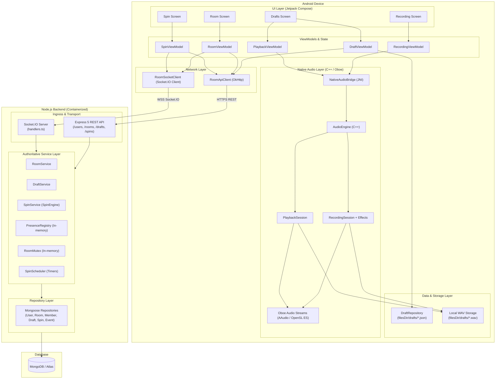

# System Architecture — Roxstar Voice Draft, Room & Spin Wheel

This document details the end-to-end architecture of the Roxstar application, spanning the Android client, native C++ audio engine (Oboe), Node.js backend, and persistence layer.

---

## 1. System Overview

The system is composed of two primary tiers:
1. **Android Client Application**: A modern Jetpack Compose application with an Oboe C++ native audio engine, local Draft persistence, OkHttp REST client, and Socket.IO realtime client.
2. **Backend Service**: A Node.js 22 + TypeScript service using Express 5, Socket.IO for realtime event delivery, and MongoDB with Mongoose for authoritative state persistence.



---

## 2. Android Client Architecture

The Android app follows modern Android Architecture guidelines with unidirectional data flow (UDF):

```
UI (Compose) ──(Intents / Actions)──> ViewModel ──(StateFlow)──> UI (Recomposition)
                                          │
                  ┌───────────────────────┼────────────────────────┐
                  ▼                       ▼                        ▼
           AudioEngine (JNI)      DraftRepository         RoomApiClient / Socket
           [Native Oboe]          [Local JSON/WAV]        [REST & Socket.IO]
```

### 2.1 Component Responsibilities

| Component | Class / File | Responsibility |
|---|---|---|
| **Main Navigation** | `MainActivity.kt` | Sets Compose content, manages top-level navigation between tabs (`Record`, `Drafts`, `Room`, `Spin`). |
| **Recording Screen** | `RecordingScreen.kt` | Displays live waveform meter, effect selector (`None`, `Echo`, `Reverb`, `Pitch Shift`), Start/Stop/Cancel controls, and handles Android `RECORD_AUDIO` permission flow. |
| **Recording ViewModel** | `RecordingViewModel.kt` | Manages `RecordingUiState`, triggers `AudioEngine.startRecording()`, `stopRecording()`, `cancelRecording()`, and passes recorded files to `DraftRepository`. |
| **Draft List Screen** | `DraftListScreen.kt` | Lists local drafts with name, creation time, duration, effect badge; provides inline playback controls, delete button, and "Share with Room" action. |
| **Draft ViewModel** | `DraftViewModel.kt` | Loads and observes local drafts via `DraftRepository`, handles draft deletion, and initiates REST sharing via `RoomApiClient`. |
| **Playback ViewModel** | `PlaybackViewModel.kt` | Coordinates with `AudioEngine` for native playback: play, pause, resume, stop, and polls playback progress. |
| **Room Screen** | `room/RoomScreen.kt` | Allows creating a room, joining by ID, displays room membership status, real-time participant badges, and shared drafts list. |
| **Room ViewModel** | `room/RoomViewModel.kt` | Combines REST actions (`createRoom`, `joinRoom`, `leaveRoom`) with real-time Socket.IO room events (`user_joined`, `user_left`, `draft_shared`, `room_state`). |
| **Spin Screen & Wheel** | `spin/SpinScreen.kt`, `spin/SpinView.kt` | Visual animated wheel rendering active players in dynamic canvas sectors, countdown indicator, elimination history, and winner celebratory dialog. |
| **Spin ViewModel** | `spin/SpinViewModel.kt` | Maintains `SpinUiState`, triggers owner spin start via REST, handles `spin_started`, `user_eliminated`, and `winner_announced` socket events. |

---

## 3. Native Audio Architecture

The native audio subsystem (`native-audio/`) is implemented in C++17 and bridges to Kotlin via JNI (`NativeAudioBridge.kt` and `native-audio/jni_bridge.cpp`).

### 3.1 Key Modules
- **`AudioEngine`**: Manages Oboe audio streams (AAudio when available, OpenSL ES as fallback). Serializes stream open/start/stop/close lifecycle.
- **`RecordingSession`**: Handles real-time capture. Runs inside the Oboe `onAudioReady` callback. Applies audio effects in-place, calculates peak signal levels, pushes audio samples into a lock-free `RingBuffer`, and offloads file I/O to a background writer thread (`WavWriter`).
- **`PlaybackSession`**: Reads PCM WAV audio into an in-memory `PlaybackBuffer` using `WavReader` and streams samples out through an Oboe output stream.
- **`effects/`**: Real-time DSP algorithms:
  - `EchoEffect`: Single-tap feedback delay line with sample-rate tuned buffer.
  - `ReverbEffect`: Schroeder topology (4 parallel damped comb filters + 2 series allpass filters).
  - `PitchShiftEffect`: Time-domain granular overlap-add shifter fixed at 1.5x ratio.

---

## 4. Backend Service Architecture

The backend is an authoritative Node.js/TypeScript application designed with strict separation between transport, domain logic, and persistence.

### 4.1 Layering
1. **Transport Layer**:
   - Express 5 routers (`/health`, `/users`, `/rooms`, `/drafts`, `/spins`).
   - Socket.IO gateway (`websocket/handlers.ts`) with connection registry and room event dispatch.
2. **Authoritative Domain Services**:
   - `roomService`: Owns room creation, joins, departures, and presence sync.
   - `draftService`: Handles draft metadata storage and room draft sharing.
   - `spinService`: Implements the multiplayer elimination wheel state machine.
   - `roomMutex`: In-process async mutex ensuring serialized operations per room.
   - `spinScheduler`: Self-scheduling timer mechanism with absolute deadline drift correction.
3. **Persistence Layer**:
   - Mongoose models and repositories: `userRepository`, `roomRepository`, `roomMemberRepository`, `draftRepository`, `draftShareRepository`, `spinRepository`, `spinParticipantRepository`, `spinEventRepository`.
4. **Database**:
   - MongoDB database with compound and partial unique indexes enforcing invariants at the database level.
