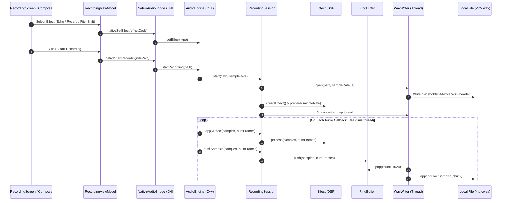
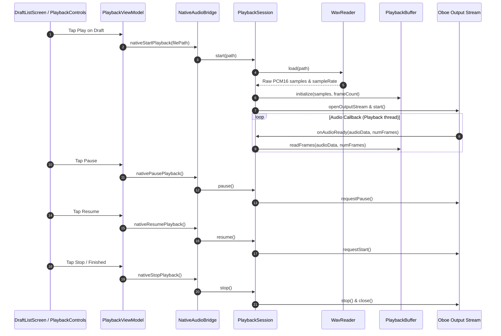

# Audio Flow & Processing Pipeline

This document specifies the audio recording, processing, storage, and playback pipelines implemented in the Roxstar application across the Android Kotlin layer and the native C++ Oboe engine.

---

## 1. End-to-End Pipeline Overview

```
Android UI (Compose)
       │
       ▼ (User actions: Start, Stop, Cancel, Select Effect, Play)
RecordingViewModel / PlaybackViewModel
       │
       ▼ (Kotlin AudioEngine wrapper)
NativeAudioBridge (JNI interface)
       │
       ▼ (C++ JNI entry points in jni_bridge.cpp)
AudioEngine (C++)
       │
       ├─────────────────────────────────────────────┐
       ▼ (Recording path)                            ▼ (Playback path)
RecordingSession                              PlaybackSession
       │                                             │
       ├─ applyEffect() (In-place DSP)               ├─ WavReader (Parse PCM16)
       ├─ RingBuffer (Lock-free FIFO)                ├─ PlaybackBuffer (Mono-to-stereo/mono)
       ├─ WavWriter (Background thread)              └─ Oboe Output Stream (Audio playback)
       │
       ▼
Local Storage (filesDir/drafts/<id>.wav + <id>.json)
```

---

## 2. Recording Pipeline & Lifecycle

### 2.1 Capture and Processing Path

1. **Stream Input**: The microphone stream is opened by Oboe (`oboe::AudioStreamBuilder`) with `Direction::Input`, `PerformanceMode::LowLatency`, and `SharingMode::Exclusive` (or `Shared` fallback).
2. **Audio Callback (`onAudioReady`)**:
   - Executes on the OS real-time audio thread.
   - Downmixes multi-channel input (if stereo) to mono float32 samples.
   - Applies the selected DSP effect in-place via `RecordingSession::applyEffect()`.
   - Computes the instantaneous peak signal level (used by the UI waveform meter).
   - Writes processed float samples into the lock-free `RingBuffer`.
3. **Background Writer Thread**:
   - Loops independently on `RecordingSession::writerLoop()`.
   - Pops blocks of up to 1024 samples from `RingBuffer`.
   - Quantizes float32 samples (`[-1.0, 1.0]`) to 16-bit signed integer PCM (`FloatToInt16`).
   - Appends PCM bytes to the open file via `WavWriter`.



### 2.2 Stop and Finalization

When the user taps **Stop**:
1. `RecordingViewModel` calls `AudioEngine.stopRecording()`.
2. Native `RecordingSession::stopAndFinalize()` is invoked:
   - Atomically sets `mActive = false` (stops accepting new samples from the audio callback).
   - Atomically sets `mStopRequested = true` to inform the background writer thread to drain remaining samples.
   - Joins the writer thread (`mWriterThread.join()`).
   - Performs a final drain pass on `RingBuffer` to ensure zero samples are lost.
   - Calls `WavWriter::finalize()`, which updates the 44-byte WAV header with the actual `RIFF` chunk size and `data` byte count, then flushes and closes the file descriptor.
3. Upon receiving `AudioStatus.OK`, `RecordingViewModel` computes the duration and instructs `DraftRepository` to write `<id>.json` metadata.

### 2.3 Cancellation and Discard

When the user taps **Cancel**:
1. `RecordingViewModel` calls `AudioEngine.cancelRecording()`.
2. Native `RecordingSession::cancelAndDiscard()` is executed:
   - Sets `mActive = false` and joins the writer thread.
   - Calls `WavWriter::abortAndDelete()`, which immediately closes the file descriptor and calls `std::remove(path.c_str())`.
   - Leaves **zero partial or temporary files** on disk.
3. No Draft record is created in `DraftRepository`.

---

## 3. Real-Time Safety Guarantees

The audio capture callback `AudioEngine::onAudioReady` and every effect's `process()` method strictly adhere to real-time audio constraints:

| Prohibited in Callback | How Roxstar Complies |
|---|---|
| **Memory Allocation (`new`, `malloc`)** | All buffers (delay lines, comb filters, ring buffer, pitch-shift accumulator) are sized once in `prepare()` on the JNI thread before recording begins. |
| **Mutexes & Locking** | Lock-free synchronization via `std::atomic` acquire/release semantics. |
| **File / Disk I/O** | All disk writes occur in `writerLoop` on a dedicated background worker thread. |
| **JNI Calls** | Status and peak levels are communicated via shared atomic snapshots; JNI never executes from the audio thread. |
| **Logging / Printing** | No `printf`, `ALOG`, or logging primitives in the audio processing loop. |

---

## 4. Local Draft Persistence & Lifecycle

Local recordings are saved inside the application's private files directory: `context.filesDir/drafts/`.

```
filesDir/drafts/
  ├── <uuid-1>.wav    # 16-bit PCM Mono audio file
  ├── <uuid-1>.json   # Metadata (id, name, duration, createdAt, effect, filePath)
  ├── <uuid-2>.wav
  └── <uuid-2>.json
```

### 4.1 Reconciliation & Crash Recovery

`DraftRepository` and `RecordingCleanup` enforce deterministic state reconciliation:

| WAV Status | JSON Status | Handled State |
|---|---|---|
| Valid WAV | Present | **Valid Draft**: Displayed in list, available for playback and sharing. |
| Missing WAV | Present | **Corrupted/Missing File**: Displayed greyed out; deleting removes the orphan JSON record. |
| Unfinalized WAV | Missing | **Crash Orphan**: `RecordingCleanup.removeOrphaned()` detects header size mismatch (`riffChunkSize == 0` while file length > 44) on application startup and purges the file. |
| Finalized WAV | Missing | **Unreferenced WAV**: Ignored by repository and safely bypassed. |

---

## 5. Playback Pipeline & Lifecycle

Playback uses a native Oboe output stream driven by `PlaybackSession`:



### 5.1 Controls Supported
- **Start Playback**: Loads the file into `PlaybackBuffer` and initiates streaming.
- **Pause Playback**: Pauses the Oboe stream preserving the read position.
- **Resume Playback**: Resumes streaming from the paused position.
- **Stop Playback**: Stops and closes the output stream, resets read position to zero.
- **Progress Tracking**: `nativeGetPlaybackProgress()` returns float `[0.0, 1.0]` representing `currentFrame / totalFrames`.

---

## 6. Known Audio Limitations

1. **Pitch Shift Latency**: The time-domain granular overlap-add algorithm introduces a fixed latency of one grain (1024 samples, ~21ms at 48kHz). The first 1024 samples of a pitch-shifted recording are silent by design.
2. **Transient Smearing**: Granular overlap-add with a 1.5x pitch shift ratio produces slight smearing on fast vocal transients due to windowed overlapping without phase vocoding.
3. **Formant Preservation**: The native pitch shifter resamples grains directly without formant tracking, giving upward-shifted audio a characteristic "chipmunk" timbre.
4. **Channel Format**: Native capture downmixes to single-channel mono float, and saved WAV files are single-channel 16-bit PCM.
