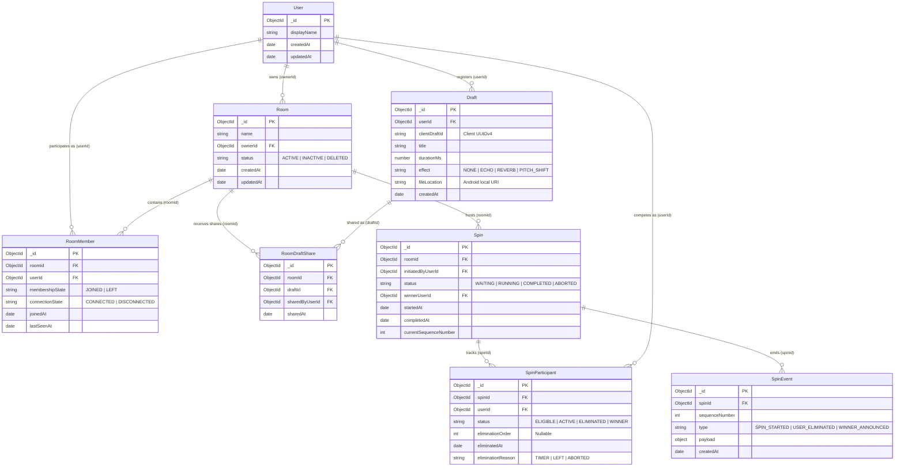

# Database Design & Persistence Architecture

This document describes the database schema, entity relationships, index constraints, and persistence strategy for the **RoxStar Voice Draft, Real-Time Room & Spin Wheel** backend service.

---

## 1. Overview & Engine Selection

The backend uses **MongoDB** as its primary data store with **Mongoose** as the Object Data Modeling (ODM) layer. The database models domain entities for identity, local draft registry, room membership, and multiplayer spin wheel state transitions.

All schema definitions reside in [`backend/src/models/`](file:///e:/Resumes/RoxStar/Assignment/backend/src/models/), and database queries are isolated in [`backend/src/repositories/`](file:///e:/Resumes/RoxStar/Assignment/backend/src/repositories/).

### Index Lifetime Management
Index building is disabled on connection initialization (`autoIndex: false`). The application explicitly triggers `syncAllIndexes()` during startup before accepting HTTP or WebSocket traffic to prevent runtime query performance degradation or silent index omission.

---

## 2. Entity Relationship Diagram

---

## 3. Core Database Entities

### 3.1 `User`
Stores user identity metadata. Identity headers (`x-user-id`) supplied in REST requests are validated against this collection.

- **Collection**: `users`
- **Primary Key**: `_id` (`ObjectId`)
- **Key Fields**: `displayName` (`string`), `createdAt` (`Date`)

### 3.2 `Room`
Represents a multiplayer voice draft room owned by a user.

- **Collection**: `rooms`
- **Primary Key**: `_id` (`ObjectId`)
- **Indexes**: `{ ownerId: 1 }`, `{ status: 1 }`

### 3.3 `RoomMember`
Tracks per-user membership state (`JOINED` vs `LEFT`) and live transport connection state (`CONNECTED` vs `DISCONNECTED`).

- **Collection**: `roommembers`
- **Partial Unique Index**: `{ roomId: 1, userId: 1 }` where `membershipState = 'JOINED'`.
  - *Invariant*: A user can have at most one active `JOINED` membership in a given room at any time.

### 3.4 `Draft`
Registers metadata for a voice recording captured on an Android device.

- **Collection**: `drafts`
- **Fields**: `clientDraftId` (UUIDv4), `title`, `durationMs`, `effect`, `fileLocation`.

### 3.5 `RoomDraftShare`
Records the event of a user sharing a voice draft to a specific room.

- **Collection**: `roomdraftshares`
- **Indexes**: `{ roomId: 1, sharedAt: -1 }`

### 3.6 `Spin`
Maintains the state machine of a multiplayer spin wheel execution (`WAITING`, `RUNNING`, `COMPLETED`, `ABORTED`).

- **Collection**: `spins`
- **Partial Unique Index**: `{ roomId: 1 }` where `status IN ['WAITING', 'RUNNING']`.
  - *Invariant*: Prevents concurrent spin starts. Exactly one active spin can exist per room at any instant.

### 3.7 `SpinParticipant`
Tracks per-participant state inside an active spin (`ELIGIBLE`, `ACTIVE`, `ELIMINATED`, `WINNER`).

- **Collection**: `spinparticipants`
- **Partial Unique Index**: `{ spinId: 1, eliminationOrder: 1 }` where `eliminationOrder` is a number (`$type: 'number'`).
  - *Invariant*: Guarantees unique, non-overlapping elimination ranks for participants in a spin.

### 3.8 `SpinEvent`
Auditable, monotonic event log for spin lifecycle events (`SPIN_STARTED`, `USER_ELIMINATED`, `WINNER_ANNOUNCED`).

- **Collection**: `spinevents`
- **Unique Index**: `{ spinId: 1, sequenceNumber: 1 }`

---

## 4. Concurrency & Integrity Invariants

| Invariant | Target Collection | Index Definition | Enforcement Mechanism |
|---|---|---|---|
| **Single Active Spin** | `spins` | `{ roomId: 1 }` (`partialFilterExpression: { status: { $in: ['WAITING', 'RUNNING'] } }`) | Atomic index rejection (Duplicate Key Error 11000) prevents race conditions. |
| **Unique Active Membership** | `roommembers` | `{ roomId: 1, userId: 1 }` (`partialFilterExpression: { membershipState: 'JOINED' }`) | Handled idempotently; repeat join requests return HTTP 200 without duplicate rows. |
| **Unique Elimination Ranks** | `spinparticipants` | `{ spinId: 1, eliminationOrder: 1 }` (`partialFilterExpression: { eliminationOrder: { $type: 'number' } }`) | Prevents duplicate elimination order assignment during multi-timer or crash recovery scenarios. |
