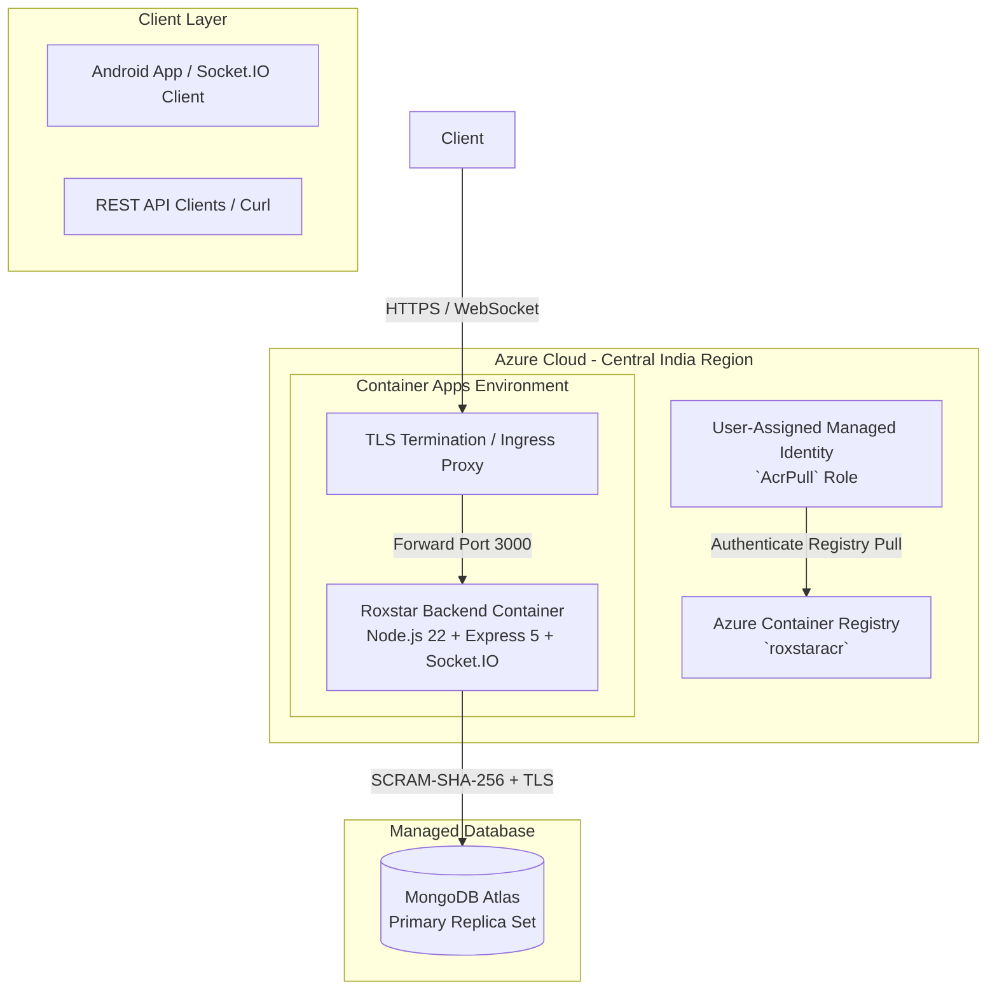

# Azure Container Apps Deployment & Operations Runbook

This document details the production cloud deployment, CI/CD pipeline, security posture, container health monitoring, single-replica topology, and rehearsed rollback procedures for the **RoxStar Voice Draft, Real-Time Room & Spin Wheel** backend service on **Azure Container Apps** and **MongoDB Atlas**.

---

## 1. Cloud Architecture Overview



---

## 2. Production Deployment Topology

| Property | Value / Setting | Rationale |
|---|---|---|
| **Cloud Provider** | Azure | Centralized Container Apps infrastructure in `centralindia`. |
| **Container App Name** | `roxstar-backend` | Defined in `infrastructure/containerapp.yaml`. |
| **Database Provider** | MongoDB Atlas | Managed MongoDB deployment running Atlas cluster. |
| **Replica Bounds** | `minReplicas: 1`, `maxReplicas: 1` | Single replica pinned to avoid splitting in-memory presence and timer state. |
| **Revision Mode** | `Single` | Atomically replaces running revision without multi-revision traffic splitting. |
| **Live Production URL** | [`https://roxstar-backend.politecliff-541c339a.centralindia.azurecontainerapps.io`](https://roxstar-backend.politecliff-541c339a.centralindia.azurecontainerapps.io) | Public HTTP/WebSocket entrypoint. |

---

## 3. CI/CD Pipeline & GitHub OIDC Federation

The deployment pipeline is fully automated via GitHub Actions in [`.github/workflows/deploy.yml`](file:///e:/Resumes/RoxStar/Assignment/.github/workflows/deploy.yml) and [`.github/workflows/ci.yml`](file:///e:/Resumes/RoxStar/Assignment/.github/workflows/ci.yml).

### 3.1 Authentication & Zero-Secret Model
- **GitHub OIDC (`azure/login@v2`)**: Eliminates stored long-lived client secrets. Short-lived tokens are issued per deployment run.
- **Managed Identity (`AcrPull`)**: Container Apps pulls container images directly from Azure Container Registry (ACR) using a User-Assigned Managed Identity (`roxstar-backend-id`), requiring no static registry passwords.

### 3.2 Automated Release Gates
1. **Verification Stage (`ci.yml`)**:
   - `npm run typecheck`
   - `npm run lint`
   - `npm test` (Backend Unit)
   - `npm run test:integration` (Integration against real MongoDB container)
   - `npm run build`
2. **Build & Immutable Tagging Stage**:
   - Docker image compiled using pinned base image `node:22-alpine`.
   - Image published to ACR tagged with immutable git SHA (`:<commit-sha>`).
3. **Deployment & Verification Stage**:
   - Issue `az containerapp update --image :<commit-sha>`.
   - Assert `minReplicas` and `maxReplicas` remain `1/1` and revision mode remains `Single`.
   - Poll readiness probe (`/ready`) until status returns `200 OK`.
   - Execute post-deployment smoke test (`scripts/smoke.mjs`).

---

## 4. Health Probes & Container Monitoring

The Docker container and Azure Container Apps ingress utilize two decoupled health endpoints to distinguish between process liveness and data store readiness:

| Endpoint | Probe Type | Target / Purpose | Behavior |
|---|---|---|---|
| **`GET /health`** | **Liveness Probe** | Process responsiveness. Never queries MongoDB. | Always returns HTTP 200 `{ "status": "ok" }`. Triggers container restart if unresponsive. |
| **`GET /ready`** | **Readiness / Startup Probe** | Data store connectivity check. Queries Mongoose connection status. | Returns HTTP 200 `{ "status": "ready", "database": "connected" }` when connected; HTTP 503 when disconnected. Prevents routing traffic during database outages without killing the container. |

---

## 5. Rollback & Recovery Runbook

### 5.1 Rollback Strategy
Rollback is executed as an **image restore** to a previously published, immutable git SHA container image (`:<previous-commit-sha>`), rather than building new un-tested code.

### 5.2 Rollback Procedure
1. Identify the target immutable container image SHA from Azure Container Registry (`roxstaracr.azurecr.io/roxstar-backend:<previous-sha>`).
2. Update Container App revision:
   ```bash
   az containerapp update \
     --name roxstar-backend \
     --resource-group roxstar-backend-rg \
     --image roxstaracr.azurecr.io/roxstar-backend:<previous-sha>
   ```
3. Confirm revision transition status:
   ```bash
   az containerapp revision list \
     --name roxstar-backend \
     --resource-group roxstar-backend-rg \
     --output table
   ```
4. Execute health and smoke check against target endpoint:
   ```bash
   node backend/scripts/smoke.mjs https://roxstar-backend.politecliff-541c339a.centralindia.azurecontainerapps.io
   ```
