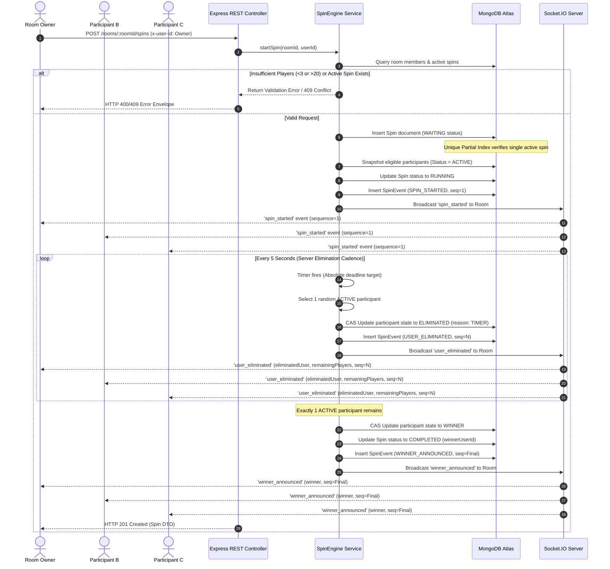

# Spin Wheel Event Sequence & Interaction Specification

This document presents the detailed execution sequence, message timing, and interaction flows for the **Multiplayer Spin Wheel** engine.

---

## 1. Overview

The spin wheel operates as a server-authoritative, timed elimination game. The server manages all participant state transitions, elimination selections, 5-second tick resolution, database persistence, and Socket.IO broadcasts. Clients render UI animations based exclusively on server-issued events.

---

## 2. End-to-End Sequence Diagram

---

## 3. Sequence Step Descriptions

### 3.1 Initiation & Pre-Checks
1. The room owner issues `POST /rooms/:roomId/spins`.
2. The `SpinService` validates that the caller matches `Room.ownerId`.
3. The count of active room members (`membershipState = 'JOINED'`) is verified to be between **3 and 20**.

### 3.2 Atomic Insertion & Event Emission
4. The server creates a `Spin` document with `status = 'WAITING'`. A unique partial index on `Spin{ roomId }` for active statuses (`WAITING`, `RUNNING`) guarantees that duplicate concurrent requests fail atomically with a `409 Conflict` database exception.
5. All current joined members are snapshot as `SpinParticipant` records with status `ACTIVE`.
6. The spin transitions to `RUNNING`, and a `spin_started` event (`sequenceNumber = 1`) is recorded in `SpinEvent` and broadcast over Socket.IO.

### 3.3 Timed Elimination Loop
7. A `setTimeout` schedule runs with a **5000 ms cadence** (configurable in environment).
8. On each tick, the engine randomly selects one active participant, assigns an explicit `eliminationOrder` integer, and sets their status to `ELIMINATED` (`eliminationReason = 'TIMER'`).
9. A `user_eliminated` event is logged to MongoDB and broadcast to all room sockets with the updated remaining player list.

### 3.4 Completion & Winner Declaration
10. When the active participant count reaches exactly 1, the loop terminates.
11. The final participant is marked as `WINNER`, the spin status transitions to `COMPLETED`, and `completedAt` is timestamped.
12. A `winner_announced` payload carrying the winner DTO and sequence number is emitted to all room participants.
