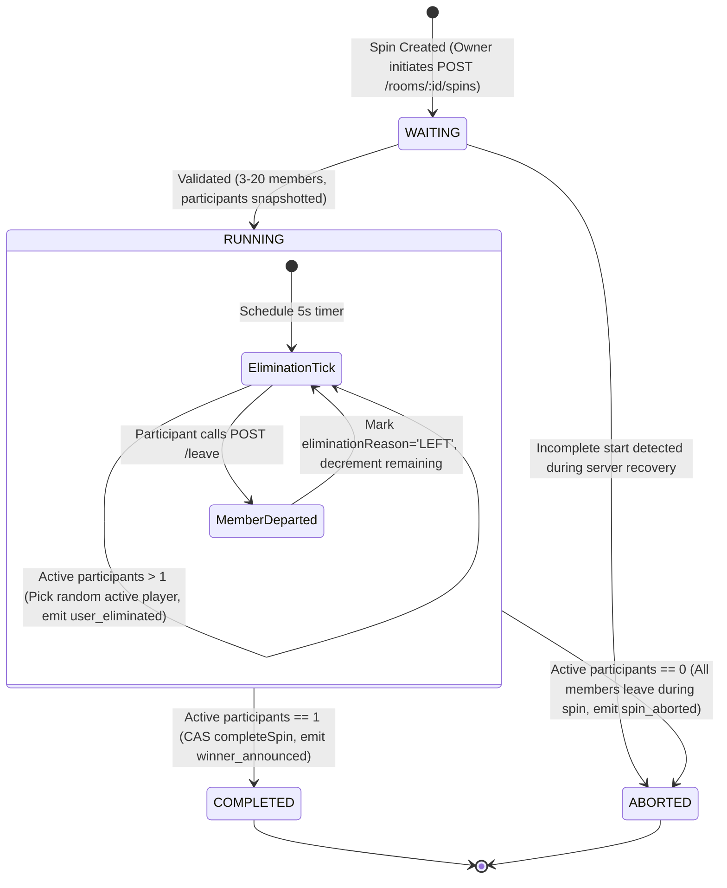
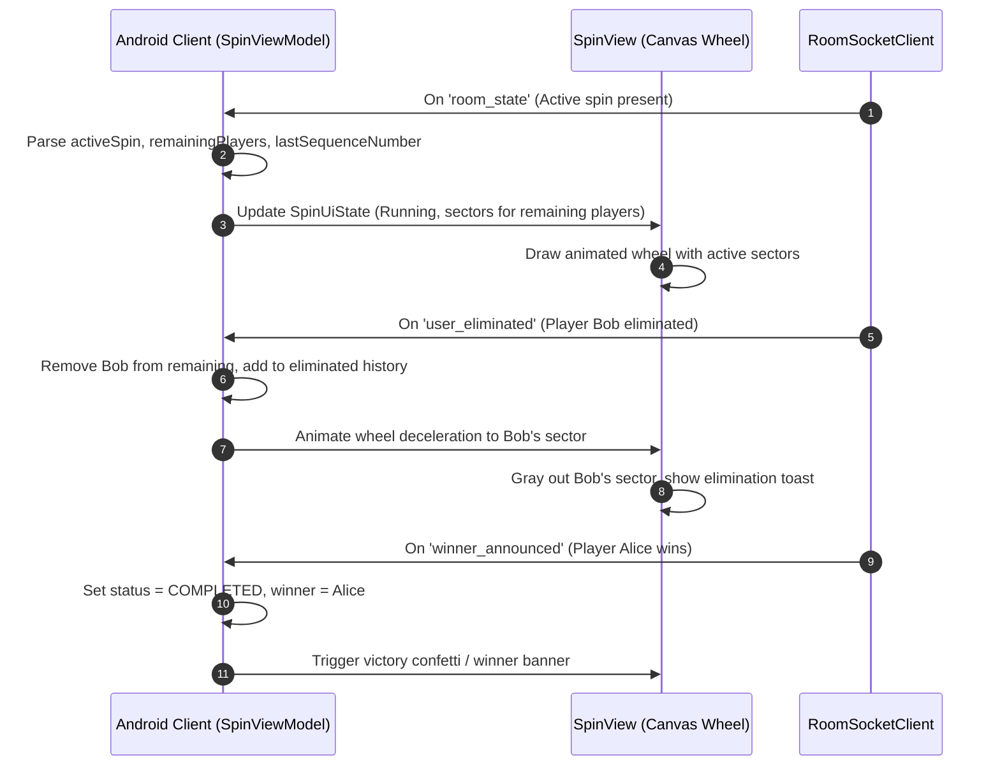

# Spin Wheel State Machine & Lifecycle

This document specifies the authoritative server-side spin engine lifecycle, state transitions, elimination sequence, edge case resolutions, and client-side wheel rendering.

---

## 1. State Machine Diagram



---

## 2. States & Transition Specifications

| State | Entry Condition | Invariants & Processing | Exit Transitions |
|---|---|---|---|
| **`WAITING`** | Room owner initiates spin. | Database record created; participant records being initialized. | Transitions to `RUNNING` upon successful initialization; or `ABORTED` if server restarts during incomplete start. |
| **`RUNNING`** | Start validation passes. | Self-scheduling absolute-deadline timer active (every 5000ms default). Spin is locked via partial unique index (`roomId` + active status). | `COMPLETED` when exactly 1 active player remains.<br/>`ABORTED` if all remaining players depart. |
| **`COMPLETED`** | Remaining active players reaches 1. | Exactly-once winner selected via compare-and-swap (`completeSpin`). Timers cancelled. Final event logged. | Terminal state. |
| **`ABORTED`** | Zero active participants remain, or incomplete start recovered. | Spin cancelled without a winner. Timers cancelled. Abort event logged. | Terminal state. |

---

## 3. Start Validation & Concurrency Guarantees

### 3.1 Eligibility Constraints
- **Caller is Owner**: Caller's `x-user-id` must match `room.ownerUserId`; otherwise returns `403 NOT_ROOM_OWNER`.
- **Player Bounds**: The room must have between 3 and 20 active members (`MIN_PLAYERS = 3`, `MAX_PLAYERS = 20`); otherwise returns `409 INSUFFICIENT_PLAYERS` or `409 TOO_MANY_PLAYERS`.
- **No Concurrent Spins**: A room can have at most one active spin (`WAITING` or `RUNNING`). This is guaranteed at the database level by a partial unique index on `spins`:
  ```javascript
  { roomId: 1 }, { unique: true, partialFilterExpression: { status: { $in: ['WAITING', 'RUNNING'] } } }
  ```
  Any concurrent start request fails with `409 ACTIVE_SPIN_EXISTS`.

---

## 4. Elimination Cadence & Drift Prevention

### 4.1 Drift-Free Timer Scheduling (`spinScheduler.ts`)
Rather than relative `setInterval` delays which accumulate clock drift, each elimination tick calculates its deadline from the absolute `startedAt` timestamp:

$$\text{TargetDeadline} = \text{startedAt} + (\text{tickIndex} \times \text{SPIN\_ELIMINATION\_INTERVAL\_MS})$$

The timer sleeps for $\max(0, \text{TargetDeadline} - \text{Date.now()})$. If execution is delayed by CPU contention, subsequent ticks self-correct without drift.

### 4.2 Step Execution
1. Pick a random player among participants with `status = 'ACTIVE'`.
2. Update participant record to `status = 'ELIMINATED'`, `eliminationOrder = N`, and `eliminationReason = 'TIMER'`.
3. Append `user_eliminated` event to `spin_events` table with the next monotonic `sequenceNumber`.
4. Broadcast `user_eliminated` over Socket.IO to all room members.
5. If remaining active players equals 1, invoke `completeWithWinner()`.

---

## 5. Handled Edge Cases (Assessment Quality Rules)

| Scenario | Handled Resolution |
|---|---|
| **Member departs during RUNNING (SP-9)** | Participant is immediately eliminated with `eliminationReason = 'LEFT'`. An elimination event is logged and broadcast. If this leaves 1 player, that player wins; if 0, spin aborts. |
| **Member drops network during RUNNING (SP-10)** | **No elimination.** Disconnect affects presence only, not membership. The player remains active in the spin and can win or be eliminated by the timer while offline. |
| **Room owner leaves / disconnects (SP-14)** | Spin continues uninterrupted. If the owner was a participant, they are eliminated like any other member. Room ownership does not transfer. |
| **Actives drop below 3 mid-spin (SP-11)** | The spin continues. 3–20 players is a start-time invariant only; mid-spin eliminations naturally reduce the count towards 1. |
| **Client reconnects mid-spin (SP-10)** | Client receives `room_state` containing `activeSpin` with all eliminated and remaining players and `lastSequenceNumber`. Wheel state and eliminations are immediately restored. |
| **Server restart during spin (SP-17)** | Startup recovery (`spinRecovery.ts`) inspects `RUNNING` spins, computes elapsed intervals, catches up past ticks, and reschedules the remaining timer sequence. Orphan `WAITING` spins are aborted (`RECOVERED_INCOMPLETE_START`). |

---

## 6. Client-Side Wheel Rendering & State Reconstruction



The Android `SpinView` custom canvas renders dynamic pie sectors sized evenly among initial participants:
- Active participants retain their distinct sector colors.
- Eliminated participants are greyed out with an elimination marker.
- The pointer animates smoothly using cubic-bezier deceleration to align with server-directed elimination events.
